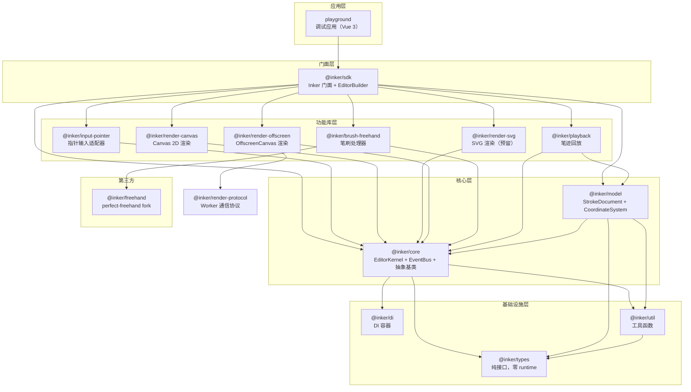
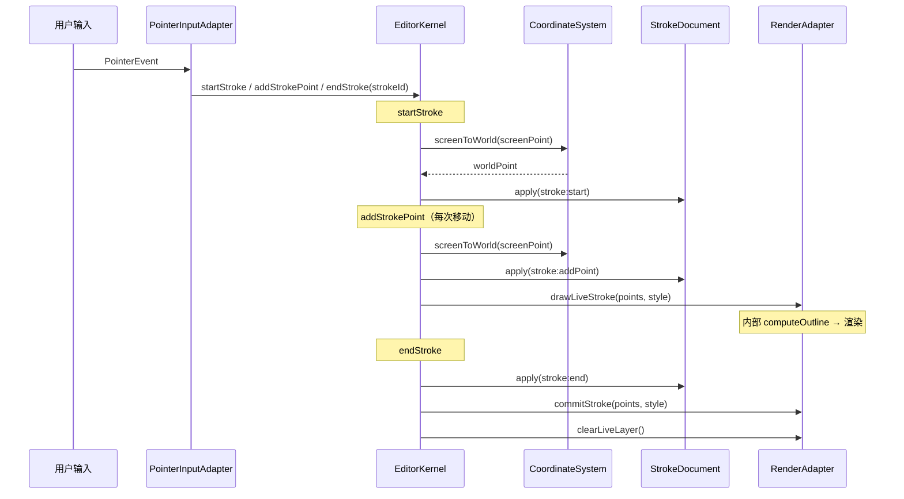
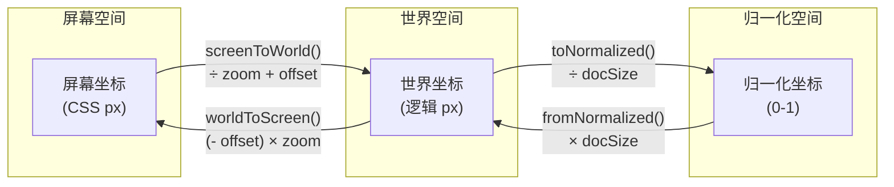

# Inker

Inker 是一个模型驱动的数字墨迹 SDK，采用输入-模型-渲染三层解耦架构。输入适配器与渲染器均可插拔替换，内置 Canvas 2D、OffscreenCanvas Worker、SVG 三种渲染器；所有数据变更由 Operation 驱动，Operation 即 source of truth，天然支持撤销/重做与笔迹回放。提供多种笔刷（钢笔、墨水笔、马克笔、铅笔）、橡皮擦模式、压感模拟、多指同时书写、视口缩放/平移等能力。

## 架构总览



## 渲染管线



## 坐标系统



运行时全程使用**世界坐标（绝对像素）**，Camera 管理视口变换：

- `screenToWorld()`: 屏幕坐标 → 世界坐标（输入时转换）
- `worldToScreen()`: 世界坐标 → 屏幕坐标（渲染由 Canvas `setTransform` 自动完成）
- `toNormalized()` / `fromNormalized()`: 序列化/导出用工具方法

## 快速开始

```bash
# 安装依赖
pnpm install

# 启动 playground
pnpm dev

# 全量构建
pnpm build

# 全量测试
pnpm test

# 类型检查
pnpm typecheck
```

### 使用 SDK

```typescript
import { Inker } from '@inker/sdk'

// 快速创建
const editor = Inker.create({
  element: document.getElementById('canvas')!
})

// 切换工具
editor.penStyle = { type: 'pen', color: '#000', width: 2, opacity: 1 }

// 缩放/平移
editor.zoomAt(mouseX, mouseY, 2.0) // 锚点缩放
editor.pan(deltaX, deltaY) // 平移
editor.zoomToFit() // 自动适应

// 撤销/重做
editor.undo()
editor.redo()
editor.clear()

// 事件监听
editor.on('document:changed', snapshot => {
  /* ... */
})

// 销毁
editor.dispose()
```

### 自定义构建

```typescript
import { Inker } from '@inker/sdk'

const editor = Inker.builder()
  .withElement(container)
  .withDocumentSize(1920, 1080)
  .withPenStyle({ type: 'pen', color: '#333', width: 3, opacity: 1 })
  .withAllowedPointerTypes(['pen', 'touch'])
  .build()
```

## 项目结构

```
inker/
├── shared/                  # 共享基础设施（types、di、util）
├── libraries/               # 核心功能库（core、model、输入/渲染适配器、笔刷、回放、sdk）
├── third-parties/           # 第三方源码 fork（perfect-freehand）
├── solutions/               # 业务场景方案（识别数据准备等，不发布到 SDK）
├── playground/              # Vue 3 交互式调试应用
├── e2e/                     # Playwright 端到端测试
├── docs/                    # 设计文档与规格说明
├── scripts/                 # 构建脚本（产物拷贝等）
├── run-control/             # 共享配置（tsconfig、vitest、vite）
└── dist/                    # 构建产物（ES + UMD + .d.ts）
```

## 核心设计原则

| 原则                | 实践                                                                  |
| ------------------- | --------------------------------------------------------------------- |
| **SOLID**           | 接口隔离（@inker/types）、依赖倒置（DI 容器）、开闭原则（适配器模式） |
| **适配器模式**      | 输入、渲染两类适配器可独立替换                                        |
| **策略模式**        | 笔刷处理器可插拔切换                                                  |
| **门面模式**        | @inker/sdk 封装复杂内部结构，对外暴露简洁 API                         |
| **Operation-based** | 所有数据变更通过 Operation，Operation 是 source of truth              |
| **Camera 架构**     | 运行时全程绝对坐标，Camera 统一管理 resize/zoom/pan                   |

## 技术栈

- **语言**: TypeScript (strict mode, ES2022+)
- **构建**: Vite lib mode, ESM only
- **测试**: Vitest + happy-dom
- **包管理**: pnpm workspace + catalog
- **版本管理**: @changesets/cli
