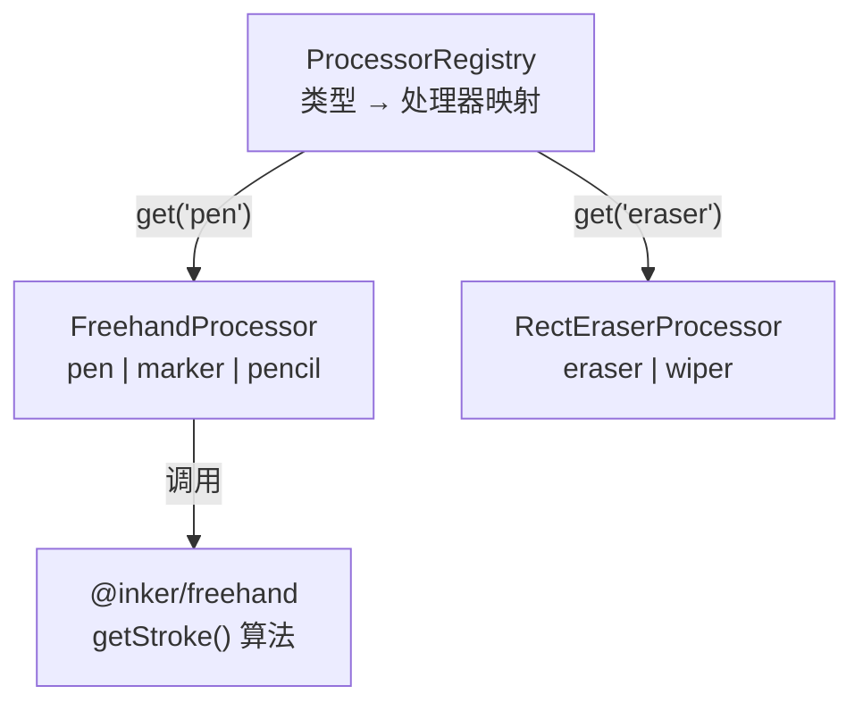
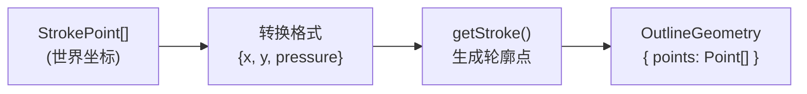
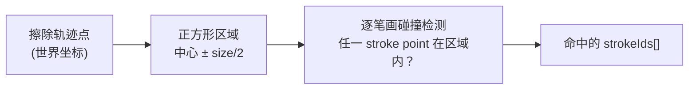

# @inker/brush-freehand

Inker SDK 的笔刷处理器模块。基于 perfect-freehand 算法，将采样点序列转换为 OutlineGeometry 轮廓几何。

## 处理器架构



## FreehandProcessor

将采样点通过 perfect-freehand 算法转换为渲染器无关的轮廓几何数据：



### 支持的笔画类型

| 类型 | 说明 | 特点 |
|------|------|------|
| `pen` | 钢笔 | 标准压感笔画 |
| `marker` | 马克笔 | 较大笔宽 |
| `pencil` | 铅笔 | 细腻纹理感 |

### 传递到 getStroke 的参数

```typescript
{
  size: style.size,          // 笔画基准直径
  thinning: style.thinning,  // 压感对粗细的影响
  smoothing: style.smoothing,// 边缘平滑
  streamline: style.streamline, // 流线平滑
  start: { taper: style.start?.taper ?? 0, cap: style.start?.cap ?? true },
  end: { taper: style.end?.taper ?? 0, cap: style.end?.cap ?? true },
  last: complete,            // 是否为已完成笔画
  simulatePressure: false    // 压力由 PressureSimulator 处理
}
```

## RectEraserProcessor

矩形区域擦除：每个擦除点生成一个正方形碰撞区域，检测与已有笔画点的相交：



### 支持的擦除类型

| 类型 | 说明 |
|------|------|
| `eraser` | 橡皮擦（小范围精确擦除） |
| `wiper` | 黑板擦（大范围批量擦除） |

## ProcessorRegistry

处理器注册表，管理 StrokeType → StrokeProcessor 映射：

```typescript
import { ProcessorRegistry, FreehandProcessor, RectEraserProcessor } from '@inker/brush-freehand'

const registry = new ProcessorRegistry()

// 注册处理器（自动注册其 supportedTypes 中的所有类型）
registry.register(new FreehandProcessor())   // pen, marker, pencil
registry.register(new RectEraserProcessor()) // eraser, wiper

// 查找处理器
const processor = registry.get('pen')  // FreehandProcessor
registry.has('eraser')                  // true

// 同类型重复注册会覆盖
```
