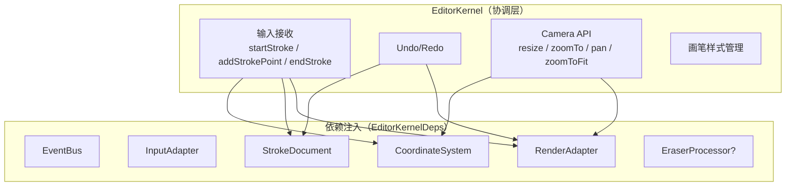
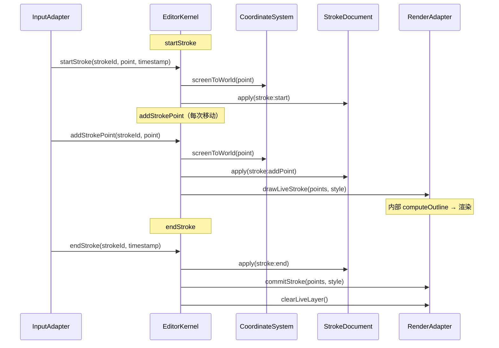
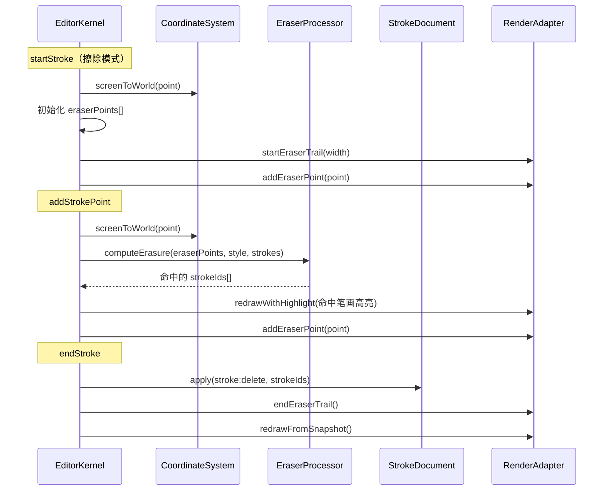

# @inker/core

Inker SDK 的核心模块。提供 EditorKernel 编排层、EventBus 事件总线、抽象基类和 DI ServiceTokens。

## 职责划分

- **EditorKernel**：纯协调层，编排输入 → 处理 → 存储 → 渲染流程，不含业务逻辑
- **EventBus**：类型安全的发布/订阅事件总线
- **抽象基类**：为适配器和策略提供骨架实现
- **ServiceTokens**：DI 容器的注入标识符

## EditorKernel 架构



## 绘制流程



## 橡皮擦流程



## Camera API

EditorKernel 提供完整的视口控制：

```typescript
// 获取/设置 Camera
kernel.camera               // { x, y, zoom }
kernel.setCamera(camera)

// 容器尺寸变化
kernel.resize(width, height)

// 锚点缩放（鼠标下的世界坐标不移动）
kernel.zoomTo(screenAnchorX, screenAnchorY, newZoom)

// 平移（屏幕像素偏移量）
kernel.pan(deltaScreenX, deltaScreenY)

// 自动适应文档到容器
kernel.zoomToFit()
```

## EventBus

```typescript
import { EventBus } from '@inker/core'

const bus = new EventBus()

// 订阅（返回取消函数）
const unsub = bus.on('stroke:end', data => {})

// 一次性订阅
bus.once('document:changed', snapshot => {})

// 发布
bus.emit('stroke:end', { stroke })

// 取消 / 销毁
unsub()
bus.dispose()
```

## ServiceTokens

DI 容器的注入标识符（`InjectionToken`），用于 `container.register()` 和 `container.resolve()`：

```typescript
import {
  EVENT_BUS,
  INPUT_ADAPTER,
  RENDER_ADAPTER,
  STROKE_PROCESSOR,
  STROKE_DOCUMENT,
  COORDINATE_SYSTEM
} from '@inker/core'
```

## 抽象基类

实现 `@inker/types` 中定义的接口，由具体包继承：

| 抽象基类 | 实现接口 | 具体实现 |
|---------|---------|---------|
| `RenderAdapter` | `RenderAdapterInterface` | `CanvasRenderAdapter`（@inker/render-canvas）、`OffscreenRenderAdapter`（@inker/render-offscreen） |
| `StrokeProcessor` | `StrokeProcessorInterface` | `FreehandProcessor`（@inker/brush-freehand） |
| ~~`ComputeStrategy`~~ | ~~`ComputeStrategyInterface`~~ | ~~已废弃：计算逻辑已内聚到 RenderAdapter~~ |
