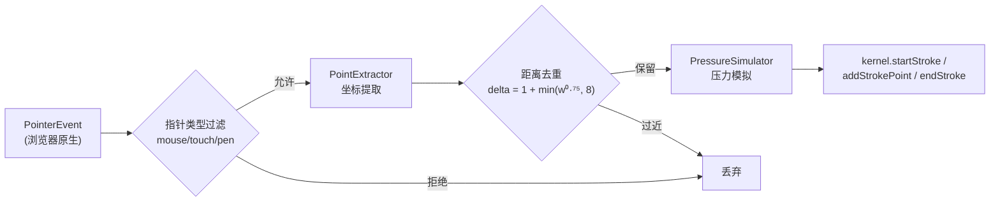
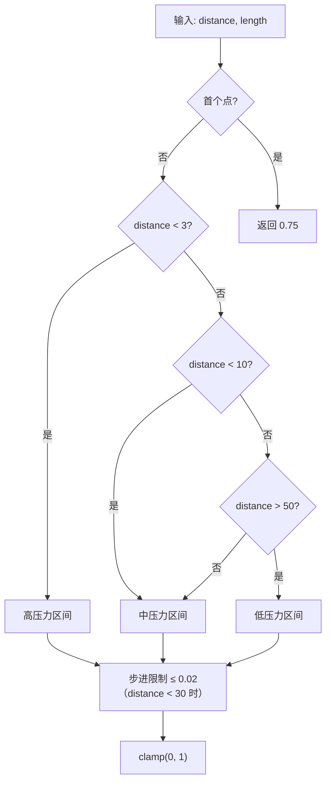

# @inker/input-pointer

Inker SDK 的 Pointer Events 输入适配器。将浏览器 PointerEvent 转换为 strokeId + 调用 kernel 方法（startStroke / addStrokePoint / endStroke）。

## 输入管线



## 关键设计

- **多指针追踪**：通过 pointerToStroke 映射同时追踪多个 active pointer，支持多指/多笔并行书写
- **坐标提取**：PointerEvent clientX/Y → 相对于 canvas 的局部坐标
- **距离去重**：基于笔宽自适应阈值过滤过密采样点（`delta = 1 + min(width^0.75, 8)`）
- **压力模拟**：无压感设备时，根据移动速度/距离模拟 0-1 压力值
- **touch-action: none**：禁用浏览器默认触摸行为（滚动、缩放）

## API

### PointerInputAdapter

```typescript
import { PointerInputAdapter } from '@inker/input-pointer'

const adapter = new PointerInputAdapter()

// 绑定内核（由 EditorBuilder 在构造 EditorKernel 后调用）
adapter.bindKernel(kernel)

// 绑定 DOM 元素
adapter.attach(element)

// 限制允许的指针类型
adapter.setAllowedPointerTypes(['pen', 'touch'])

// 解绑 / 销毁
adapter.detach()
adapter.dispose()
```

### PointExtractor

```typescript
import { PointExtractor } from '@inker/input-pointer'

const extractor = new PointExtractor()

// 从 PointerEvent 提取坐标（相对于容器偏移量）
const point = extractor.extract(pointerEvent, { left, top })
// RawPoint { x, y, pressure } 或 null（坐标无效时）

// 基于距离的去重
const keep = extractor.filterDuplicate(point, strokeWidth)
```

### PressureSimulator

```typescript
import { PressureSimulator } from '@inker/input-pointer'

const simulator = new PressureSimulator()

// 根据移动距离和累计长度计算模拟压力
const pressure = simulator.compute(distance, cumulativeLength)

// 新笔画开始时重置
simulator.reset()
```

## 压力模拟算法


