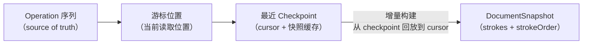
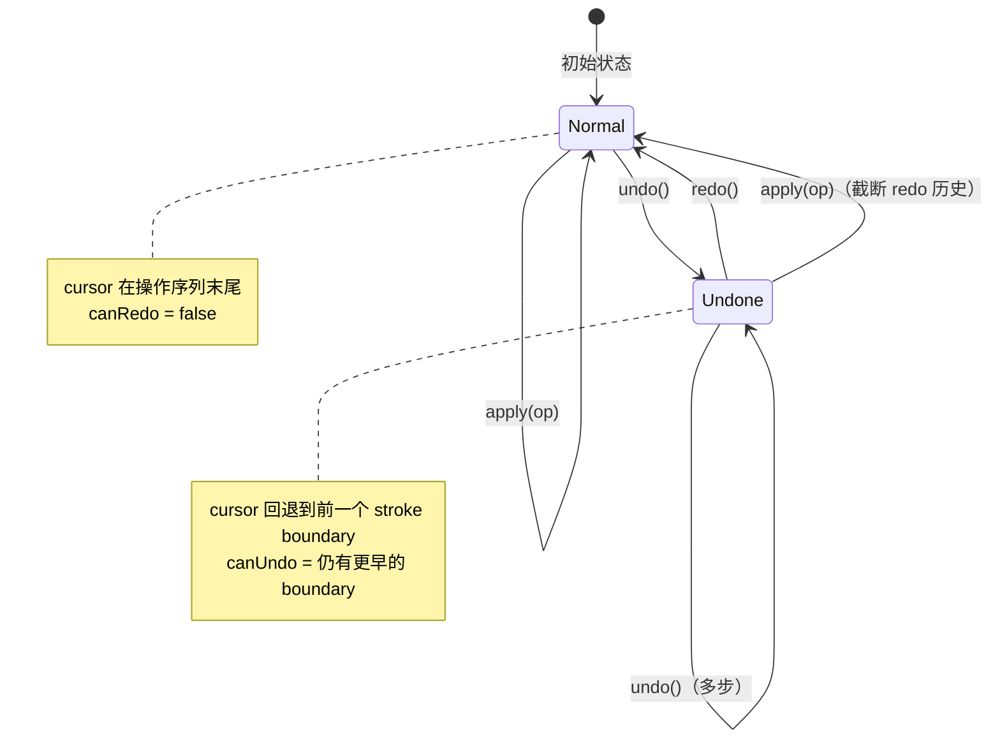
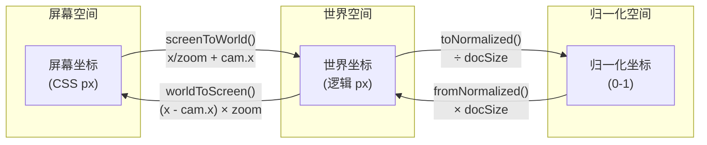
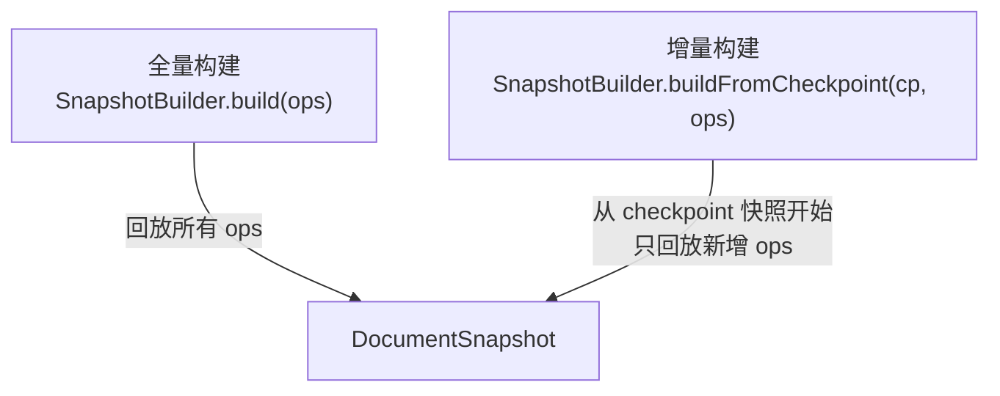

# @inker/model

Inker SDK 的数据模型层。提供 StrokeDocument（文档模型）、CoordinateSystem（坐标系统）和 SnapshotBuilder。

## 关键设计

- **Operation-based**：所有数据变更通过 Operation 应用，Operation 序列是 source of truth
- **Checkpoint 优化**：在关键操作（stroke:end / delete / clear）时创建 Checkpoint，加速快照构建
- **Camera 感知坐标系统**：统一管理屏幕坐标 ↔ 世界坐标 ↔ 归一化坐标的互转

## StrokeDocument

### Operation → Snapshot 流程



### Undo/Redo 机制



Undo/Redo 粒度为**完整笔画**（以 `stroke:end` / `stroke:delete` / `stroke:clear` 为边界）。

### 用法

```typescript
import { StrokeDocument } from '@inker/model'

const doc = new StrokeDocument()

// 应用操作
doc.apply({ type: 'stroke:start', strokeId: 's1', style, point, timestamp })
doc.apply({ type: 'stroke:addPoint', strokeId: 's1', point })
doc.apply({ type: 'stroke:end', strokeId: 's1', timestamp })

// 获取快照
const snapshot = doc.getSnapshot()
// snapshot.strokes: ReadonlyMap<string, Stroke>
// snapshot.strokeOrder: readonly string[]

// Undo/Redo
doc.undo()
doc.redo()
doc.canUndo  // boolean
doc.canRedo  // boolean
```

## CoordinateSystem

Camera 感知的坐标系统，管理三个坐标空间的互转：



### Camera 状态

```typescript
interface Camera {
  x: number    // 视口左上角在世界坐标中的 X
  y: number    // 视口左上角在世界坐标中的 Y
  zoom: number // 缩放倍率（1.0 = 100%）
}
```

### 用法

```typescript
import { CoordinateSystem } from '@inker/model'

// 创建（容器尺寸, 文档尺寸可选）
const cs = new CoordinateSystem(800, 600, 1920, 1080)

// Camera 管理
cs.setCamera({ x: 0, y: 0, zoom: 1 })
cs.camera  // { x, y, zoom }

// 坐标变换
cs.screenToWorld({ x: 400, y: 300 })  // 屏幕 → 世界
cs.worldToScreen({ x: 960, y: 540 })  // 世界 → 屏幕

// 容器 resize
cs.resizeContainer(1024, 768)

// 自动 fit（文档居中显示的 camera）
const fitCamera = cs.computeFitCamera()

// 归一化（序列化用）
cs.toNormalized({ x: 960, y: 540 })   // → { x: 0.5, y: 0.5 }
cs.fromNormalized({ x: 0.5, y: 0.5 }) // → { x: 960, y: 540 }
```

## SnapshotBuilder

从 Operation 序列构建 DocumentSnapshot，支持全量和增量（从 Checkpoint）两种模式：



```typescript
import { SnapshotBuilder } from '@inker/model'

// 全量构建
const snapshot = SnapshotBuilder.build(operations)

// 增量构建（性能优化）
const incremental = SnapshotBuilder.buildFromCheckpoint(checkpoint, newOps)
```
