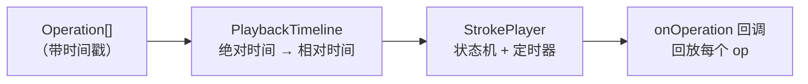
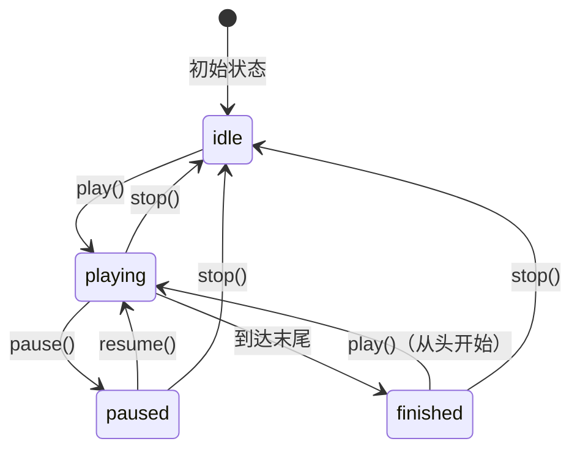

# @inker/playback

Inker SDK 的笔迹回放模块。将录制的 Operation 序列按原始时间间隔重放。

## 架构



## StrokePlayer 状态机



## PlaybackTimeline

将 Operation 的绝对时间戳转换为相对时间（从 0 开始），支持范围查询：

```typescript
import { PlaybackTimeline } from '@inker/playback'

const timeline = new PlaybackTimeline(operations)

// 总时长
timeline.duration  // ms

// 查询到某个时间点的所有 operation
timeline.getOperationsUntil(1000)

// 查询时间范围内的 operation
timeline.getOperationsBetween(500, 1000)
```

## StrokePlayer

基于 `setInterval(16ms)` 的定时器驱动回放，支持变速：

```typescript
import { StrokePlayer } from '@inker/playback'
import type { PlaybackState } from '@inker/playback'

const player = new StrokePlayer(timeline, {
  speed: 1.0  // 回放速度倍率
})

// 回调
player.onOperation = (op) => { /* 回放每个 operation */ }
player.onFinish = () => { /* 回放结束 */ }

// 控制
player.play()
player.pause()
player.resume()
player.stop()

// 状态
player.state    // 'idle' | 'playing' | 'paused' | 'finished'
player.progress // 0-1 进度

// 变速（播放中也可调整）
player.speed = 2.0

player.dispose()
```

## 关键设计

- **TICK_INTERVAL = 16ms**：约 60fps 的回放精度
- **变速支持**：调整 speed 时自动重算 startRealTime，保证进度连续
- **elapsed 计算**：`elapsed = elapsedAtPause + (realTime × speed)`
- **暂停/恢复**：暂停时记录已经过的时间，恢复时从该点继续
