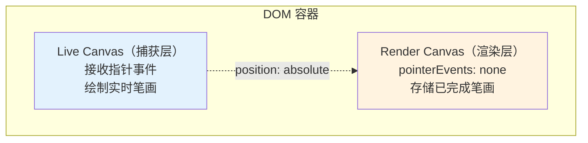
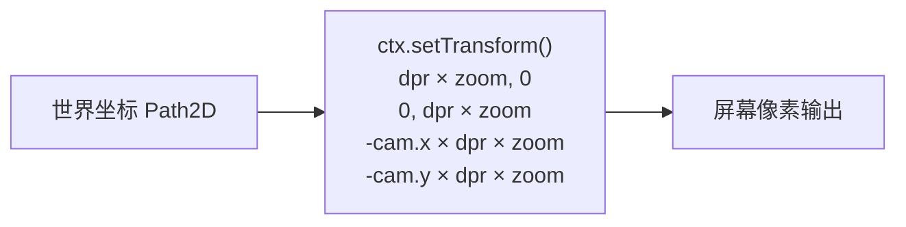

# @inker/render-canvas

Inker SDK 的 Canvas 2D 渲染适配器。基于双层 Canvas 架构，支持 Camera 变换和 DPI 缩放。

## 双层架构



| 层 | 用途 | 指针事件 | 生命周期 |
|---|---|---|---|
| **Live Canvas**（捕获层） | 实时笔画预览 + 接收指针事件 | 正常捕获 | 每笔画结束后清除 |
| **Render Canvas**（渲染层） | 持久化已完成笔画 | `pointerEvents: none` | 累积渲染 |

## Camera 变换



渲染时通过 `ctx.setTransform()` 统一处理 DPI 缩放和 Camera 变换，Path2D 数据始终使用世界坐标：

```typescript
// 绘制时自动应用变换
ctx.setTransform(
  dpr * zoom, 0,
  0, dpr * zoom,
  -camera.x * dpr * zoom,
  -camera.y * dpr * zoom
)
ctx.fill(path)  // path 使用世界坐标

// 清除时恢复 identity
ctx.setTransform(dpr, 0, 0, dpr, 0, 0)
ctx.clearRect(0, 0, width, height)
```

## 关键设计

- **内聚计算**：构造时注入 `StrokeProcessor`，内部完成 computeOutline → OutlineGeometry → Path2D 转换
- **DPI 自适应**：Canvas 物理尺寸 = CSS 尺寸 × `devicePixelRatio`
- **Camera 延迟应用**：`setCamera()` 仅存储状态，绘制时才应用 `setTransform()`
- **橡皮擦轨迹**：内置 `EraserTrail` 管理，通过 `startEraserTrail/addEraserPoint/endEraserTrail/stopEraserTrail` 控制
- **同步屏障**：`flush()` 返回 `Promise.resolve()`（同步渲染无需等待）
- **导出**：`toDataURL()` / `exportAsBlob()` 返回 Promise

## API

### CanvasRenderAdapter

```typescript
import { CanvasRenderAdapter } from '@inker/render-canvas'
import { FreehandProcessor } from '@inker/brush-freehand'

// 构造时注入笔画处理器
const adapter = new CanvasRenderAdapter(new FreehandProcessor())

// 绑定 DOM，创建双层 Canvas
adapter.attach(container, 800, 600)

// Camera 控制
adapter.setCamera({ x: 0, y: 0, zoom: 1 })

// 实时笔画（接收采样点，内部计算轮廓）
adapter.drawLiveStroke(points, strokeStyle)
adapter.clearLiveLayer()

// 提交到持久层
adapter.commitStroke(points, strokeStyle)

// 批量重绘
adapter.redrawAll(strokes)  // StrokeData[]

// 橡皮擦轨迹
adapter.startEraserTrail(baseSize)
adapter.addEraserPoint({ x, y })
adapter.endEraserTrail()
adapter.stopEraserTrail()

// 同步屏障 + 导出
await adapter.flush()
const blob = await adapter.exportAsBlob('png')
const dataURL = await adapter.toDataURL()

// 销毁
adapter.dispose()
```

### CanvasLayerManager

底层 Canvas 管理器，负责创建/销毁/调整尺寸：

```typescript
import { CanvasLayerManager } from '@inker/render-canvas'

const manager = new CanvasLayerManager(container, 800, 600)

manager.getLiveContext()    // 捕获层 2D context
manager.getRenderContext() // 渲染层 2D context
manager.resize(1024, 768)
manager.dispose()
```
