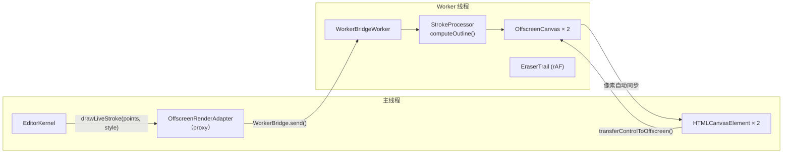

# @inker/render-offscreen

Inker SDK 的 OffscreenCanvas 渲染适配器。将笔画计算和 Canvas 渲染从主线程转移到 Web Worker，释放 UI 响应性。

## 架构



## 双组件设计

| 组件 | 位置 | 职责 |
|------|------|------|
| `OffscreenRenderAdapter` | 主线程 | 创建双 Canvas、transfer 到 Worker、通过 WorkerBridge 发送指令 |
| `startRenderWorker()` | Worker 线程 | 接收指令、调用 StrokeProcessor 计算轮廓、在 OffscreenCanvas 上绘制 |

## 使用方式

### 主线程

```typescript
import { OffscreenRenderAdapter } from '@inker/render-offscreen'

const adapter = new OffscreenRenderAdapter('render-worker.js')

// 通过 EditorBuilder 注入
Inker.builder()
  .withElement(container)
  .withRenderAdapter(adapter)
  .build()
```

### Worker 入口文件 (`render-worker.js`)

```typescript
import { startRenderWorker } from '@inker/render-offscreen'
import { FreehandProcessor } from '@inker/brush-freehand'

startRenderWorker(new FreehandProcessor())
```

## 异步模型

| 方法类型 | 行为 | 示例 |
|---------|------|------|
| 绘制命令 | fire-and-forget（void） | `drawLiveStroke()`, `commitStroke()` |
| 同步屏障 | 等待 Worker 处理完所有先前指令 | `flush()` |
| 数据返回 | async，内部自动 flush | `exportAsBlob()`, `toDataURL()` |

## 通信协议

依赖 `@inker/render-protocol` 包：
- `RenderCommand` — 主线程 → Worker 指令（15 种）
- `RenderResponse` — Worker → 主线程响应（3 种）
- `WorkerBridge` — 传输桥（send/request 模式）
