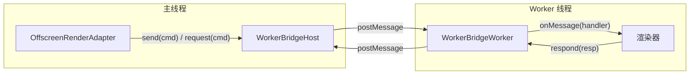

# @inker/render-protocol

Inker SDK 的 Worker 渲染通信协议包。定义主线程 ↔ Worker 之间的指令/响应类型和传输桥。

## 设计



## 通信模式

| 模式 | 方法 | 行为 | 示例指令 |
|------|------|------|---------|
| fire-and-forget | `send(cmd)` | 单向发送，不等待回复 | drawLive、commit、clearLive、setCamera |
| request-response | `request(cmd)` | 自动分配 id，返回 Promise | flush、export、toDataURL |

## 指令类型

### RenderCommand（主线程 → Worker）

| 指令 | 说明 | 关键字段 |
|------|------|---------|
| `init` | 初始化（传入 OffscreenCanvas） | renderCanvas, liveCanvas, width, height |
| `drawLive` | 绘制实时笔画 | points, style |
| `commit` | 提交到持久层 | points, style |
| `clearLive` | 清除实时层 | — |
| `redrawAll` | 批量重绘 | strokes |
| `clearAll` | 清空全部 | — |
| `setCamera` | 设置 Camera | camera |
| `resize` | 调整尺寸 | width, height |
| `startEraserTrail` | 开始橡皮擦轨迹 | baseSize |
| `addEraserPoint` | 添加轨迹点 | point |
| `endEraserTrail` | 结束轨迹（衰减） | — |
| `stopEraserTrail` | 立即停止轨迹 | — |
| `flush` | 同步屏障 | id（自动分配） |
| `export` | 导出图片 | format, quality?, id |
| `toDataURL` | 导出 DataURL | id |

### RenderResponse（Worker → 主线程）

| 响应 | 说明 | 关键字段 |
|------|------|---------|
| `flushed` | flush 完成 | id |
| `exported` | 图片导出完成 | id, blob |
| `dataURL` | DataURL 导出完成 | id, url |

## API

### WorkerBridgeHost（主线程侧）

```typescript
import { WorkerBridgeHost } from '@inker/render-protocol'

const bridge = new WorkerBridgeHost(worker)

// fire-and-forget
bridge.send({ cmd: 'drawLive', points, style })

// request-response（自动分配 id）
const resp = await bridge.request({ cmd: 'flush' })

// 销毁
bridge.dispose()
```

### WorkerBridgeWorker（Worker 侧）

```typescript
import { WorkerBridgeWorker } from '@inker/render-protocol'

const bridge = new WorkerBridgeWorker()

bridge.onMessage(cmd => {
  // 处理指令...
  if (cmd.cmd === 'flush') {
    bridge.respond({ cmd: 'flushed', id: cmd.id })
  }
})
```

### RequestCommand

`request()` 方法接受 `RequestCommand` 类型（不含 `id` 字段），Bridge 内部自动分配递增 id：

```typescript
type RequestCommand =
  | { cmd: 'flush' }
  | { cmd: 'export'; format: 'png' | 'jpeg'; quality?: number }
  | { cmd: 'toDataURL' }
```
