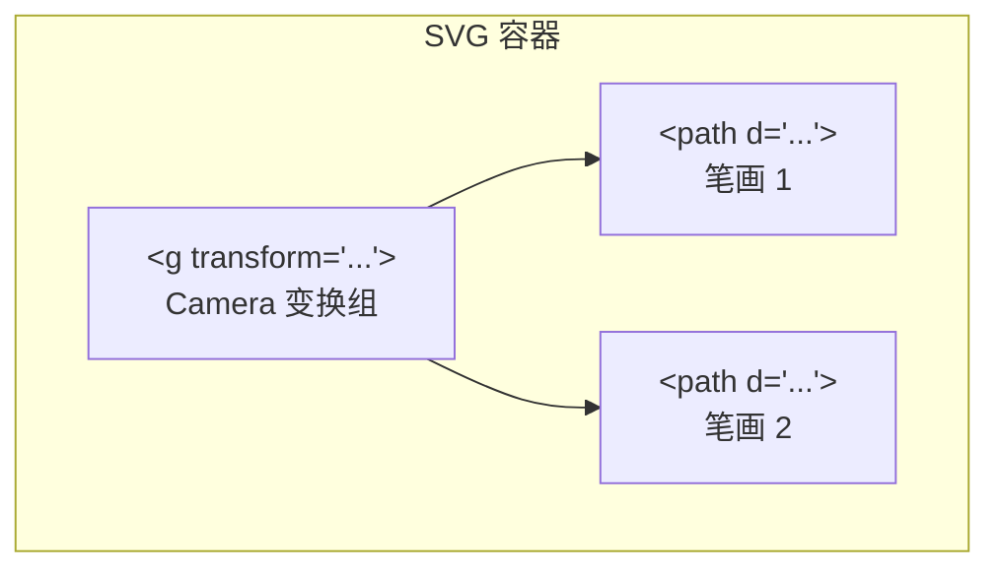

# @inker/render-svg

Inker SDK 的 SVG 渲染适配器（预留模块）。

## 设计目标

使用 SVG 元素渲染笔画，适用于需要矢量导出或 DOM 交互的场景：



## Camera 变换策略

与 Canvas 不同，SVG 通过 `<g>` 元素的 `transform` 属性实现 Camera 变换：

```typescript
// 设置一次 group transform，所有子 <path> 自动继承
viewportGroup.setAttribute('transform',
  `scale(${camera.zoom}) translate(${-camera.x}, ${-camera.y})`
)
```

## 当前状态

- 模块骨架已创建，暂无具体实现
- 继承 `RenderAdapter`（@inker/core）抽象基类
- 实现 `RenderAdapterInterface`（@inker/types）接口
