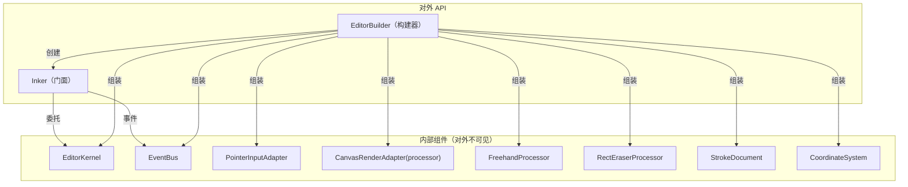
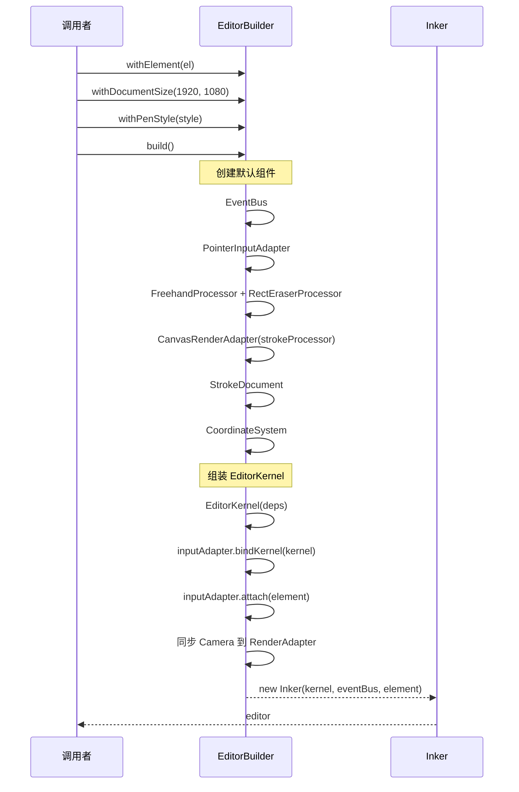

# @inker/sdk

Inker SDK 主包，唯一的对外入口。通过门面模式封装内部复杂性，通过构建器模式支持灵活配置。

## 设计模式



## 构建流程



## 快速使用

```typescript
import { Inker } from '@inker/sdk'

// 方式 1：快速创建（使用全部默认配置）
const editor = Inker.create({
  element: document.getElementById('canvas')!
})

// 方式 2：构建器模式（自定义配置）
const editor = Inker.builder()
  .withElement(container)
  .withDocumentSize(1920, 1080)
  .withPenStyle({ type: 'pen', color: '#333', width: 3, opacity: 1 })
  .withAllowedPointerTypes(['pen', 'touch'])
  .build()
```

## API

### 绘制控制

```typescript
// 画笔样式
editor.penStyle = { type: 'pen', color: '#000', width: 2, opacity: 1 }

// 撤销/重做
editor.undo()
editor.redo()
editor.clear()

// 状态查询
editor.canUndo    // boolean
editor.canRedo    // boolean
editor.isEmpty    // boolean
editor.strokeCount // number
```

### Camera 控制

```typescript
// 缩放（锚点缩放 — 鼠标下的内容不移动）
editor.zoomAt(screenX, screenY, newZoom)

// 平移
editor.pan(deltaX, deltaY)

// 自动 fit 文档到容器
editor.zoomToFit()

// 容器尺寸变化
editor.resize(width, height)

// 直接操作 camera
editor.camera  // { x, y, zoom }
editor.setCamera({ x: 0, y: 0, zoom: 1.5 })
```

### 事件监听

```typescript
editor.on('document:changed', snapshot => { /* ... */ })
editor.on('stroke:end', ({ stroke }) => { /* ... */ })
editor.on('penStyle:changed', style => { /* ... */ })
editor.off('document:changed', handler)
```

### 生命周期

```typescript
editor.dispose()  // 销毁编辑器（清理 DOM、移除事件监听、释放资源）
```

## 构建器可配置项

| 方法 | 说明 | 默认值 |
|------|------|--------|
| `withElement(el)` | DOM 容器（必需） | — |
| `withDocumentSize(w, h)` | 文档逻辑尺寸 | 等于容器尺寸 |
| `withInputAdapter(adapter)` | 自定义输入适配器 | `PointerInputAdapter` |
| `withRenderAdapter(adapter)` | 自定义渲染适配器 | `CanvasRenderAdapter` |
| `withStrokeProcessor(proc)` | 自定义笔画处理器（注入到 RenderAdapter） | `FreehandProcessor` |
| `withEraserProcessor(proc)` | 自定义橡皮擦处理器 | `RectEraserProcessor` |
| `withPenStyle(style)` | 初始画笔样式 | pen, #000, width=2 |
| `withAllowedPointerTypes(types)` | 允许的输入类型 | 全部允许 |
