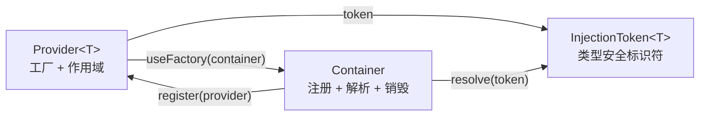
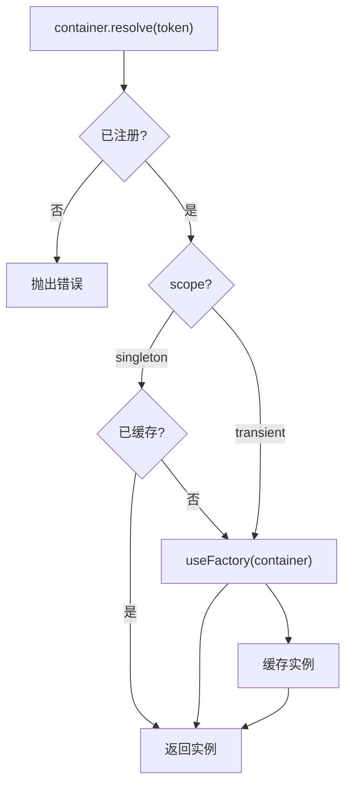

# @inker/di

轻量级依赖注入容器，零外部依赖，可独立复用。

## 设计目标

- **极简**：核心只有 Container + InjectionToken + Provider 三个概念
- **类型安全**：通过泛型 `InjectionToken<T>` 保证 resolve 返回正确类型
- **生命周期管理**：支持 singleton / transient 作用域，singleton 自动 dispose

## 核心概念



## 解析流程



## API

### Container

```typescript
import { Container } from '@inker/di'

const container = new Container()

// 注册（默认 singleton）
container.register({
  token: EVENT_BUS,
  useFactory: () => new EventBus()
})

// 注册 transient（每次 resolve 新建实例）
container.register({
  token: LOGGER,
  useFactory: () => new Logger(),
  scope: 'transient'
})

// 依赖解析链（factory 接收 container，可 resolve 其他服务）
container.register({
  token: RENDER_ADAPTER,
  useFactory: c => new CanvasRenderAdapter(c.resolve(EVENT_BUS)),
  scope: 'singleton'
})

// 解析
const bus = container.resolve<EventBus>(EVENT_BUS)

// 检查
container.has(EVENT_BUS) // true

// 销毁（调用所有 singleton 的 dispose()）
container.dispose()
```

### InjectionToken

```typescript
import { InjectionToken } from '@inker/di'

// 泛型参数确保 resolve 时返回正确类型
const EVENT_BUS = new InjectionToken<EventBus>('EventBus')
```

### Provider

```typescript
import type { Provider } from '@inker/di'

const provider: Provider<EventBus> = {
  token: EVENT_BUS,
  useFactory: (container) => new EventBus(),
  scope: 'singleton' // 'singleton' | 'transient'，默认 'singleton'
}
```

### Disposable

实现 `Disposable` 接口的 singleton 在 `container.dispose()` 时自动调用 `dispose()`：

```typescript
import type { Disposable } from '@inker/di'

class EventBus implements Disposable {
  dispose(): void {
    // 清理资源
  }
}
```
