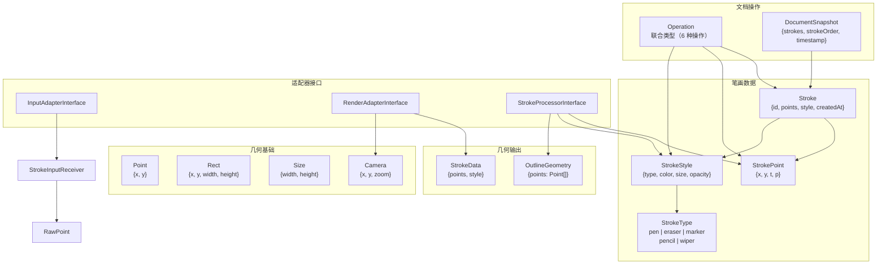
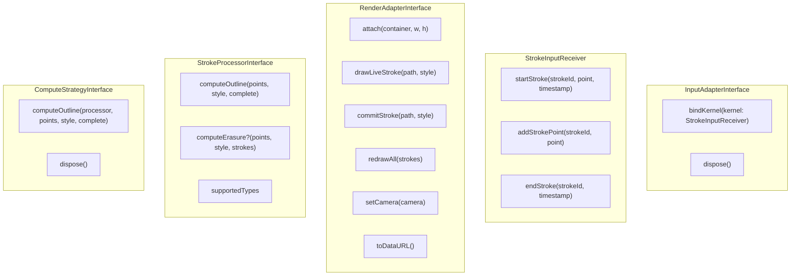

# @inker/types

Inker SDK 的纯类型定义包。**零 runtime 代码**，只包含 TypeScript 接口和类型别名。

## 设计原则

- 所有包依赖 `@inker/types`，但它不依赖任何包（依赖图的根节点）
- 只定义 `interface` 和 `type`，不包含 `class`、函数或常量
- 接口按职责拆分到独立文件，避免"上帝接口"

## 类型体系

## 文件结构

| 文件 | 类型 | 说明 |
|------|------|------|
| `geometry.types.ts` | `Point` `Rect` `Size` | 基础几何类型 |
| `camera.types.ts` | `Camera` | 视口状态（位置 + 缩放倍率） |
| `stroke-point.types.ts` | `StrokePoint` | 采样点（世界坐标 px + 时间戳 + 压力值） |
| `stroke-style.types.ts` | `StrokeType` `StrokeStyle` | 笔画类型和外观样式 |
| `stroke.types.ts` | `Stroke` | 完整笔画（ID + 点序列 + 样式 + 时间） |
| `operation.types.ts` | `Operation` | 文档变更操作（6 种操作的联合类型） |
| `document-snapshot.types.ts` | `DocumentSnapshot` | 文档状态快照 |
| `input-adapter.types.ts` | `InputAdapterInterface` `StrokeInputReceiver` | 输入适配器接口 + 笔画输入接收者接口 |
| `render-adapter.types.ts` | `RenderAdapterInterface` `StrokeData` | 渲染适配器接口（意图式 API） |
| `stroke-processor.types.ts` | `StrokeProcessorInterface` | 笔画处理器接口（返回 OutlineGeometry） |
| `outline-geometry.types.ts` | `OutlineGeometry` | 渲染器无关几何格式 |
| `compute-strategy.types.ts` | `ComputeStrategyInterface` | ~~已废弃~~ 计算策略接口 |
| `event-map.types.ts` | `EventMap` | 事件名 → 载荷类型映射 |
| `editor-options.types.ts` | `EditorOptions` `EditorTheme` | 编辑器初始化配置 |

## Operation 类型

Operation 是文档变更的 source of truth，所有数据变更都通过 Operation 应用：

| 操作类型 | 说明 | 关键字段 |
|---------|------|---------|
| `stroke:start` | 开始新笔画 | strokeId, style, point |
| `stroke:addPoint` | 追加采样点 | strokeId, point |
| `stroke:end` | 结束笔画 | strokeId |
| `stroke:delete` | 删除指定笔画 | strokeIds[] |
| `stroke:clear` | 清空所有内容 | — |

## 适配器接口

## 事件映射

| 事件名 | 载荷类型 | 触发时机 |
|--------|---------|---------|
| `document:changed` | `DocumentSnapshot` | 文档状态变更后 |
| `stroke:start` | `{ strokeId, style }` | 开始绘制 |
| `stroke:end` | `{ stroke }` | 笔画完成 |
| `stroke:delete` | `{ strokeIds }` | 笔画被删除 |
| `stroke:clear` | `void` | 清空画布 |
| `theme:changed` | `void` | 主题变更 |
| `penStyle:changed` | `StrokeStyle` | 笔画样式变更 |
