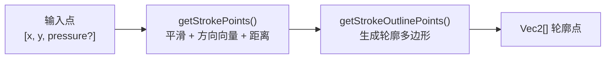
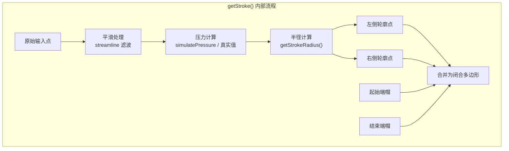

# @inker/freehand

[perfect-freehand](https://github.com/steveruizok/perfect-freehand) 第三方源码 fork。零外部依赖，可独立使用。源码版本：1.2.3；代码应该和上游保持一致，自定义代码如非必要，不要放在此处；

## 算法管线





## API

### getStroke

主入口：从输入点集生成笔画轮廓多边形。

```typescript
import { getStroke } from '@inker/freehand'

// 对象格式
const outline = getStroke([
  { x: 0, y: 0 },
  { x: 10, y: 5, pressure: 0.8 },
  { x: 20, y: 10 }
])

// 数组格式
const outline2 = getStroke([[0, 0], [10, 5, 0.8], [20, 10]])

// 带配置
const outline3 = getStroke(points, {
  size: 16,
  thinning: 0.5,
  smoothing: 0.5,
  streamline: 0.5,
  simulatePressure: true,
  start: { cap: true, taper: 0 },
  end: { cap: true, taper: 0 },
  last: false
})
```

### getStrokePoints / getStrokeOutlinePoints

低层 API，可分步调用：

```typescript
import { getStrokePoints, getStrokeOutlinePoints } from '@inker/freehand'

// 步骤 1：输入点 → 笔画点（带方向向量、距离、累计长度）
const strokePoints = getStrokePoints(points, options)

// 步骤 2：笔画点 → 轮廓多边形
const outline = getStrokeOutlinePoints(strokePoints, options)
```

### getStrokeRadius / simulatePressure

辅助函数：

```typescript
import { getStrokeRadius, simulatePressure } from '@inker/freehand'

// 根据压力计算笔画半径
const radius = getStrokeRadius(size, thinning, pressure, easing)

// 基于距离模拟压力值
const pressure = simulatePressure(prevPressure, distance, size)
```

## 配置参数

| 参数 | 类型 | 默认值 | 说明 |
|------|------|--------|------|
| `size` | number | 16 | 笔画基准直径 |
| `thinning` | number | 0.5 | 压感对粗细的影响（0 = 等宽，1 = 最大变化） |
| `smoothing` | number | 0.5 | 边缘平滑程度 |
| `streamline` | number | 0.5 | 流线平滑（对输入点做插值） |
| `simulatePressure` | boolean | true | 是否模拟压力（无压感设备时） |
| `start.cap` | boolean | true | 是否绘制起始端帽 |
| `start.taper` | number | 0 | 起始渐尖长度（px） |
| `end.cap` | boolean | true | 是否绘制结束端帽 |
| `end.taper` | number | 0 | 结束渐尖长度（px） |
| `last` | boolean | false | 是否为已完成笔画 |

## 类型

```typescript
type Vec2 = [number, number]

interface StrokePoint {
  point: Vec2
  pressure: number
  distance: number
  vector: Vec2
  runningLength: number
}
```
